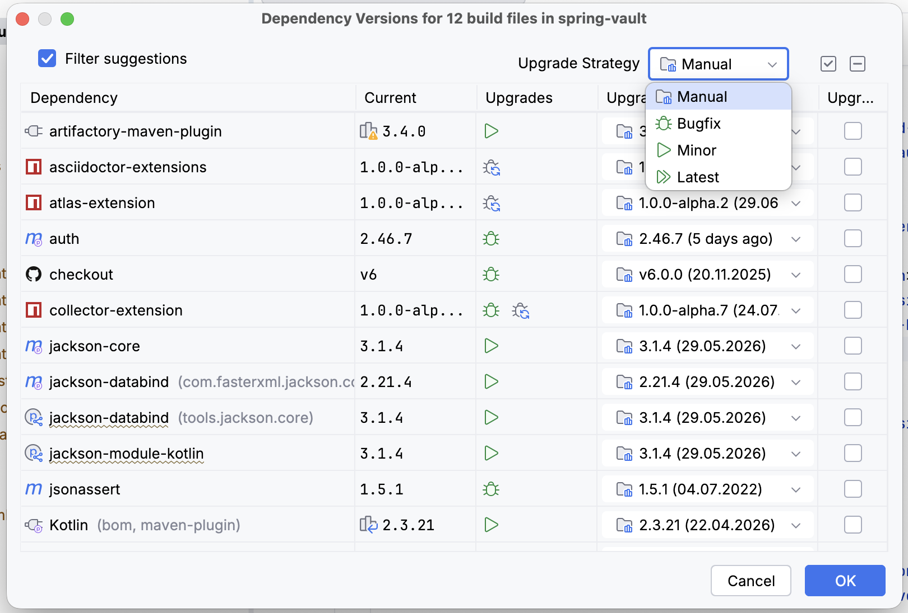
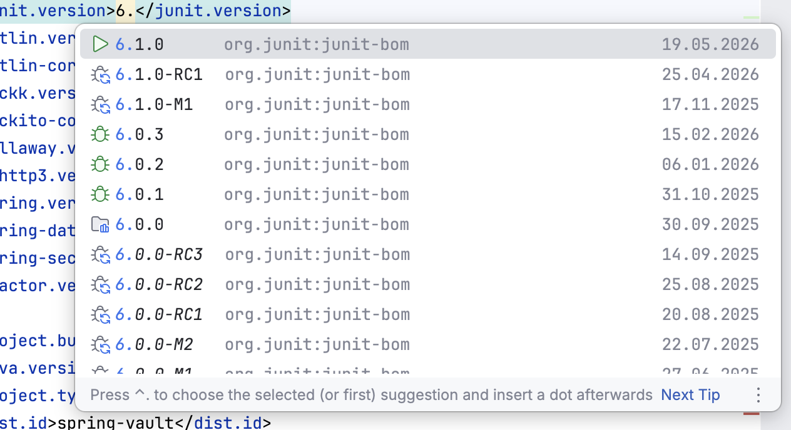
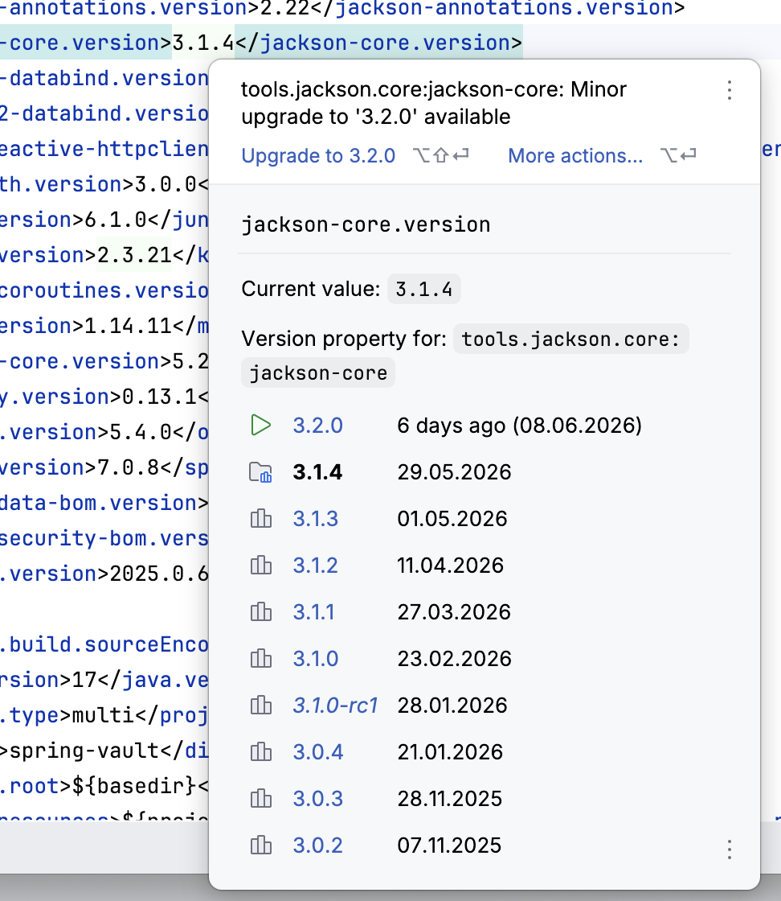

= Dependency Assistant Plugin
Mark Paluch
:experimental:
:github: https://github.com/mp911de/dependency-assistant
:jb-url: https://plugins.jetbrains.com

image:{github}/actions/workflows/build.yml/badge.svg?branch=main[Build Status (GitHub Workflow Build), link={github}/actions?query=workflow%3ABuild+branch%3Amain]

An https://plugins.jetbrains.com[IntelliJ IDEA] plugin that helps you upgrade dependencies declared in Maven, Gradle, GitHub Actions, NPM, Antora, Maven Wrapper, and Gradle Wrapper projects.
Dependency Assistant resolves available releases from the relevant repositories, registries, or release feeds and can apply updates selectively.

== Features

* Scans supported build files, including `pom.xml`, Gradle build files, Gradle version catalogs, GitHub Actions workflows, `package.json`, Antora playbooks, and wrapper properties.
* Interactive dependency upgrade review.
* Resolves versions from literals, Maven and Gradle properties, Maven profile-specific properties, Gradle version catalogs, Git refs, and wrapper URLs where possible.
* Suggests update candidates and lets you pick target versions.
* Uses ecosystem-specific release metadata sources, including Maven repositories, the Gradle Plugin Portal, Gradle distribution metadata, GitHub, Git tags, and npmjs.
* Supports Maven repository credentials declared in Maven `settings.xml` when they can be resolved by the active Maven installation.
* Inspections for Maven and Gradle wrappers.
* Inspection for Version and Declaration drift.

.Screenshot: dependency version check dialog

{empty} +

.Screenshot: Version Suggestions

{empty} +

.Screenshot: Version Documentations

== Installation

Install the *Dependency Assistant* plugin named from the IDE *Settings / Plugins* marketplace, or build the distribution locally (see <<Building>>) and install the ZIP from disk.

== Usage

. Open a supported build file in the editor.
. Start a check
** Use the intention action (light bulb) when the caret is on a supported dependency version or declaration, or
** Alternatively: Choose menu:Tools[Dependency Assistant > Update Dependencies].
. In the dialog, review suggestions, adjust *Update to* and the *Update* checkbox per row, then confirm to apply changes.

Updates are written to the build files that contain the selected dependency declarations.
The plugin may consider related files in the project when resolving coordinates, properties, catalogs, and release sources.

== Building

Prerequisites: JDK 21+, Gradle (wrapper included).

[source,shell]
----
./gradlew build
----

To produce a plugin archive for local installation:

[source,shell]
----
./gradlew buildPlugin
----

The ZIP is generated under `build/distributions/`.

Continuous integration runs tests and the IntelliJ Plugin Verifier; see the link:{github}/actions[Actions] tab on GitHub.

== Contributing

Issues and pull requests are welcome at link:{github}[{github}].

== License

Dependency Assistant is Open Source software released under the https://www.apache.org/licenses/LICENSE-2.0.html[Apache 2.0 license].
